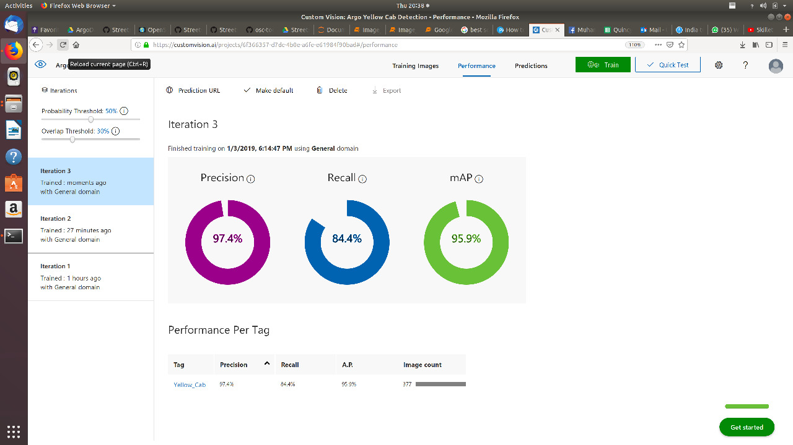
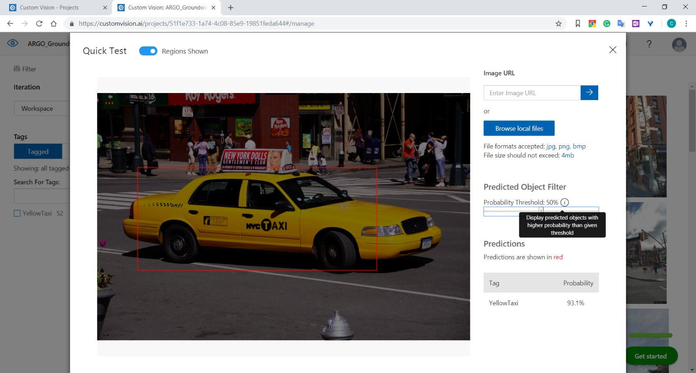
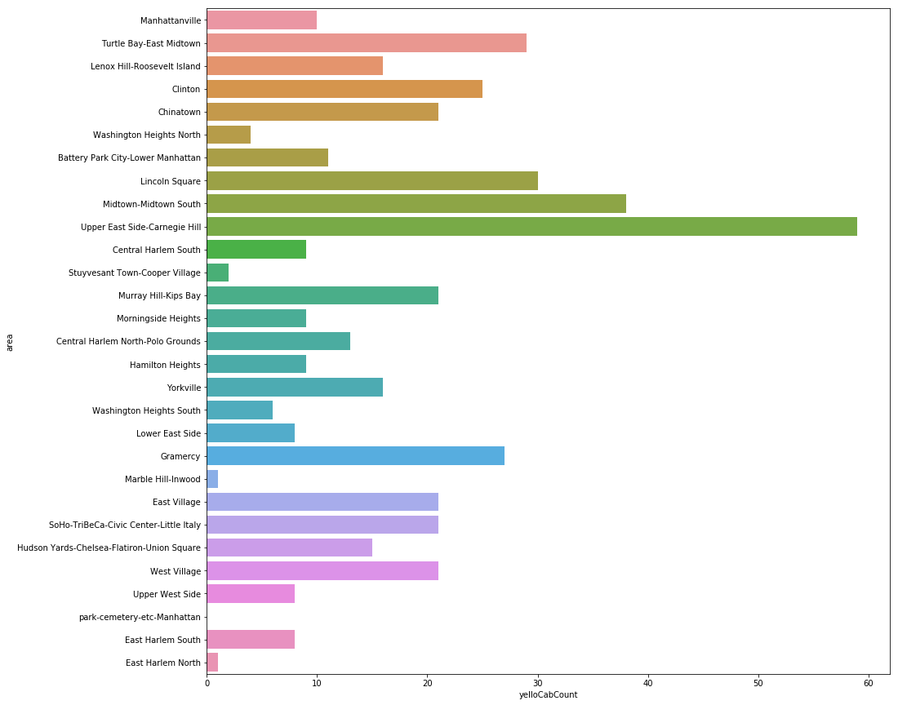
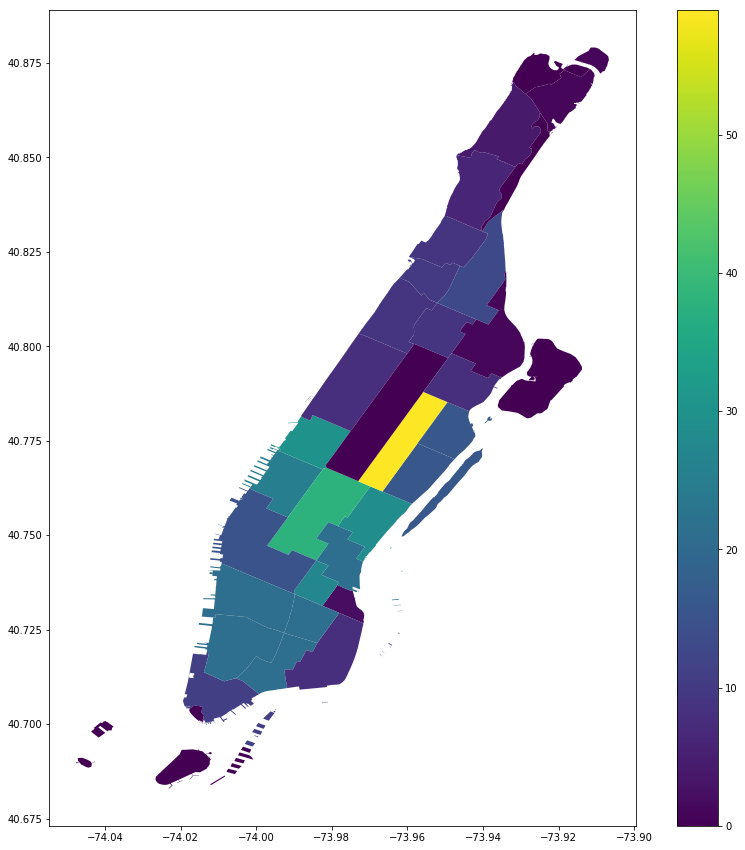

# Geographic-Distribution-of-Taxis-using-Computer-Vision

This repository contains code for:
- creating a geotagged dataset of road images using open street cam [code](https://github.com/muaz-urwa/Geographic-Distribution-of-Taxis-using-Computer-Vision/blob/master/Create%20Image%20Dataset%20from%20Open%20Street%20Cam.ipynb)
- creating a geotagged dataset of road images using google street view [code](https://github.com/muaz-urwa/Geographic-Distribution-of-Taxis-using-Computer-Vision/blob/master/Create%20image%20Dataset%20from%20Google%20Street%20View.ipynb)
- using custom vision API for inference from trained computer vision model
- analysis of geographic distribution of taxis on NY [code](https://github.com/muaz-urwa/Geographic-Distribution-of-Taxis-using-Computer-Vision/blob/master/Geographic%20Distribution%20of%20Taxis%20NYC.ipynb)

### Dataset
Dataset was created by collecting road images from google street view and open street cam. These images were manually annotated by drawing bounding boxes around the yellow cabs.

### Model
[Microsoft Custom Vision](https://azure.microsoft.com/en-us/services/cognitive-services/custom-vision-service/) was used to train a cab detection model. Read [this](https://github.com/muaz-urwa/Geographic-Distribution-of-Taxis-using-Computer-Vision/blob/master/Custom%20Vision%20Service.pdf) for my take on how custom vision works. 

### Results

